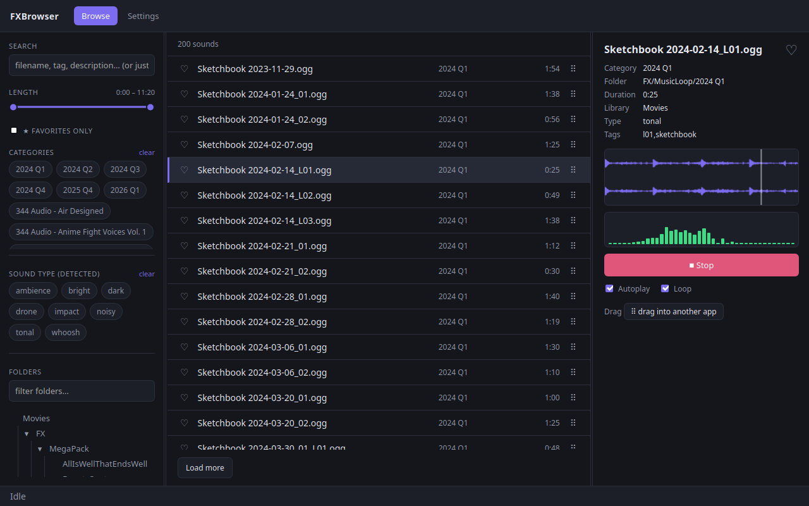
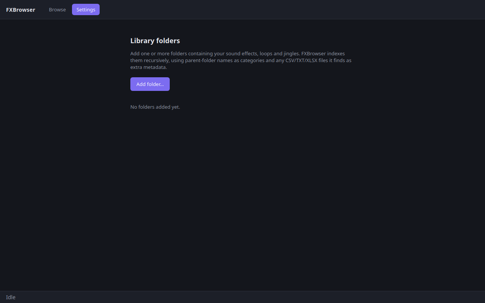

# FXBrowser

A local sound effects / loops / jingles library browser. Point it at one or more
folders, it indexes them recursively (parent-folder names become categories, and any
CSV/TXT/XLSX files it finds in a folder are read as extra per-file metadata), then lets
you search/filter, preview on loop, and drag a result straight into another app (e.g.
DaVinci Resolve's media pool) via native OS drag-and-drop.

Built with [Tauri](https://tauri.app) (Rust backend + a plain HTML/JS/CSS webview UI, no
frontend bundler). Audio preview plays natively in Rust via `rodio` (straight to
ALSA/PipeWire) rather than through WebKitGTK's `<audio>` element — see *Why not
`<audio>`?* below.

## Screenshots

| Browse | Settings |
| --- | --- |
|  |  |

## Known environment quirk: NVIDIA + Wayland

On this machine (NVIDIA proprietary driver, Wayland/KDE), WebKitGTK fails to create a
hardware GL context and renders a **blank window** unless software rendering is forced.
If that happens to you too, run the app with:

```
GDK_BACKEND=x11 LIBGL_ALWAYS_SOFTWARE=1 npm run tauri dev
```

The built release binary is wrapped by `./fxbrowser.sh`, which sets these
automatically — use that instead of calling the binary under
`src-tauri/target/release/` directly. If your GPU/driver renders fine without them, feel
free to drop the exports from that script and launch the plain binary.

## Development

```
npm install
npm run tauri dev          # or: GDK_BACKEND=x11 LIBGL_ALWAYS_SOFTWARE=1 npm run tauri dev
```

## Building a release binary

```
npm run tauri build
./fxbrowser.sh
```

Produces a `.deb` and `.rpm` under `src-tauri/target/release/bundle/`; the plain binary
`fxbrowser.sh` wraps is at `src-tauri/target/release/fxbrowser`. AppImage is left out of
`bundle.targets` in `tauri.conf.json` — building one needs FUSE to run the `linuxdeploy`
tool, which isn't available in every environment; add `"appimage"` back to `targets` if
you want one and have FUSE available.

## Why not `<audio>`?

The original implementation used a plain HTML5 `<audio>` element. On this machine it
reliably failed with WebKit's GStreamer backend reporting `FormatError` before ever
attempting to fetch/typefind the resource — reproducible with both a custom URI-scheme
protocol handler and Tauri's own built-in `asset://` protocol, and independent of Range
support, MIME-type detection, and fs-scope permissions (all individually verified
correct). Since the app is Rust-based anyway, playback was moved into Rust via `rodio`,
sidestepping WebKitGTK's media pipeline entirely. The tradeoff: no native browser scrub
bar, just a Play/Stop toggle — acceptable for previewing short SFX/loops.

## Usage

On first launch (or whenever no folders are configured) the app opens straight to
**Settings**. Click **Add folder…**, pick a directory, and it starts indexing in the
background — progress shows in the footer at the bottom of the window. Switch to
**Browse** to search or filter, click a result to load it (autoplay/loop are togglable
per-file), and drag the `⠿` handle onto another window (e.g. DaVinci Resolve) to drop
the file there.

Re-adding the same folder from Settings ("Rescan") only re-probes files whose size or
modified time changed — *unless* the indexing/analysis logic itself changed since the
last scan (tracked via `ANALYSIS_VERSION` in `indexer.rs`), in which case affected files
are reprocessed automatically on the next rescan even though nothing on disk changed.

**Browse view:**
- Free-text search, category chips, a separate **Sound type (detected)** chip filter
  (auto-detected DSP tags — see below; kept apart from categories/metadata tags on
  purpose so it doesn't get buried among them), a two-handle min/max **length** slider,
  and a **Favorites only** filter.
- Click the `♡` on any row (or in the player) to favorite it — click again to unfavorite.
- The folder tree has its own filter box, collapsible/expandable nodes, and a
  breadcrumb that shows the currently selected folder's full path above the tree.
- Sidebar / results / player panel widths are drag-resizable (grab the thin vertical
  dividers), and the Categories / Sound type sections in the sidebar are independently
  resizable in height (grab the thin horizontal dividers below each) — all sizes persist
  across launches; the layout otherwise adapts to window resizing.
- **Keyboard**: `↑`/`↓` selects the previous/next result, `Space` plays/stops the
  selected file, `Esc` clears the search box, and typing any letter jumps focus to the
  search box and starts filtering — all disabled while a text field, button, or checkbox
  already has focus so normal interaction isn't hijacked.
- The player shows a waveform (one lane per channel — two for stereo) with a live
  playhead while a file is playing. **Click anywhere on the waveform to seek** — jumps
  playback to that position (and starts playing there if nothing was playing yet).
- Below the waveform, a live **spectrum meter** (vertical bars, one per log-spaced
  frequency band — low frequencies on the left, high on the right, green→yellow→red by
  level) is FFT'd directly from the real audio stream in Rust — the classic "Mäusekino"
  display, but a real per-band analyzer rather than a scrolling level history.

## How metadata is derived

- **Category**: the immediate parent folder name of each audio file.
- **Duration / sample rate / channels / bitrate**: via `ffprobe` (must be on `PATH`).
- **Description / tags**: looked up from any `.csv`, `.xlsx`/`.xls`/`.xlsm`, or `.txt`
  file sitting in the same folder as the audio file. CSV/XLSX sidecars are matched by a
  filename/name column (best-effort header detection); TXT sidecars are parsed
  line-by-line, best-effort. Filename tokens are also folded in as tags.
- **DSP auto-tags** (`dsp.rs`): decodes up to the first ~8 seconds of each file and runs
  a small set of classic, deterministic signal-processing features through it — no ML,
  no model weights:
  - RMS envelope shape (attack time, decay ratio) → `impact` / `whoosh` / `drone` /
    `ambience`
  - Spectral flatness (tonal vs. noise-like) → `tonal` / `noisy`
  - Spectral centroid (brightness) → `bright` / `dark`

  This is a best-effort approximation meant to make a large, unlabeled library more
  filterable out of the box, not an authoritative classifier.
